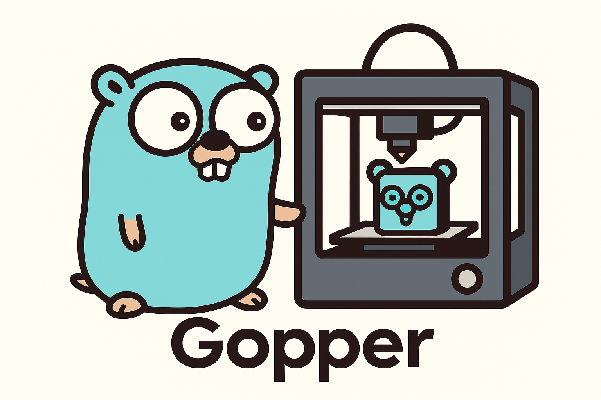

# Gopper


A Klipper firmware implementation in TinyGo for modern microcontrollers.

Gopper brings the power of Go to 3D printer firmware, providing a modern, type-safe, and maintainable alternative to C-based implementations while maintaining full compatibility with the Klipper protocol.

## Features

- ✅ Full Klipper protocol compatibility
- ✅ Written in TinyGo for optimal embedded performance
- ✅ Modular architecture for easy customization
- ✅ Type-safe implementation with Go's strong typing
- ✅ Support for modern microcontrollers
  - **RP2040** (Raspberry Pi Pico) - Full support
  - **RP2350** (Raspberry Pi Pico 2, Crea8) - Full support
  - STM32G0B1/H723 (planned)

## Status

⚠️ **Early Development** - This project is in active development and not yet ready for production use.

**Latest Update (2025-11-28):** RP2350 now has **full feature parity** with RP2040! All 74 commands working including steppers, endstops (GPIO, analog, I2C), and TMC driver support.

### Current Progress

**Phase 1: Core Protocol (Completed ✅)**
- ✅ VLQ encoding/decoding (Klipper-compatible)
- ✅ CRC16 implementation
- ✅ Buffer management (InputBuffer, OutputBuffer, FifoBuffer)
- ✅ Transport layer with message framing
- ✅ Command dispatch system
- ✅ Unit tests for all components

**Phase 2: Minimum Viable Commands (Completed ✅)**
- ✅ Data dictionary generation system
- ✅ Constants and enumerations registry
- ✅ Core protocol commands:
  - `identify` / `identify_response`
  - `get_uptime` / `uptime`
  - `get_clock` / `clock`
  - `get_config` / `config`
  - `config_reset`
  - `finalize_config`
  - `allocate_oids`
  - `emergency_stop`
- ✅ RP2040 hardware timer integration
- ✅ USB CDC communication (native USB support)
- ✅ Complete main loop with USB I/O

**Phase 3: Peripheral Modules (In Progress ⏳)**
- ✅ ADC driver infrastructure
  - ✅ **RP2040:** 4 channels (ADC0-ADC3) + temperature sensor
  - ✅ **RP2350:** 5 channels (ADC0-ADC3) + temperature sensor
  - ✅ Klipper analog_in protocol
  - ✅ Pin enumeration system
- ✅ GPIO driver infrastructure
  - ✅ **RP2040:** 30 GPIO pins (gpio0-gpio29)
  - ✅ **RP2350:** 48 GPIO pins (gpio0-gpio47)
  - ✅ Digital output/input support (pull-up/pull-down)
  - ✅ PWM capable outputs
- ✅ PWM driver infrastructure (RP2040/RP2350)
  - ✅ Hardware PWM support (8 channels)
- ✅ SPI driver infrastructure (RP2040/RP2350)
  - ✅ Hardware SPI (2 controllers with multiple pin configs)
  - ✅ Software SPI (bit-banging fallback)
- ✅ I2C driver infrastructure (RP2040/RP2350)
  - ✅ Hardware I2C communication
- ✅ Stepper driver infrastructure (RP2040/RP2350)
  - ✅ config_stepper, queue_step, set_next_step_dir, reset_step_clock
  - ✅ stepper_get_position and stepper_position response
  - ✅ stepper_stop_on_trigger for homing
  - ✅ PIO-accelerated backend (500kHz+ step rate)
- ✅ Endstop handling (RP2040/RP2350)
  - ✅ Trigger synchronization (trsync)
  - ✅ Digital, analog, and I2C endstop support
  - ✅ Coordinated multi-axis homing
- ✅ TMC driver support (RP2040/RP2350)
  - ✅ SPI and UART configuration commands
- ⏳ Heater/temperature control

## Supported Hardware

### Fully Supported ✅
- **RP2040** (Raspberry Pi Pico)
  - 30 GPIO pins
  - Full feature support (ADC, GPIO, PWM, SPI, I2C, Steppers, Endstops)
  - PIO-accelerated stepper control (500kHz step rate)

- **RP2350** (Raspberry Pi Pico 2, Crea8 board)
  - 48 GPIO pins (gpio0-gpio47)
  - Full feature support (ADC, GPIO, PWM, SPI, I2C, Steppers, Endstops, TMC drivers)
  - PIO-accelerated stepper control (up to 8 steppers via 2 PIO blocks)
  - See [targets/rp2350/README.md](targets/rp2350/README.md) for details

### Planned
- STM32F4 series
- STM32H7 series
- More to come...

## Communication

Gopper uses **native USB CDC (Communications Device Class)** for communication with the Klipper host. This provides:

When you flash Gopper to your board, it will enumerate as a USB serial device:
- **Linux**: `/dev/ttyACM0`
- **macOS**: `/dev/tty.usbmodem*`
- **Windows**: `COM3` (or similar)

**Recommended: Use Persistent Device Path**

Instead of `/dev/ttyACM0` (which can change if you have multiple USB serial devices), use the persistent `/dev/serial/by-id/` path:

```bash
# List available USB serial devices by ID
ls -l /dev/serial/by-id/

# Example output:
# lrwxrwxrwx 1 root root 13 Nov 12 10:00 usb-Raspberry_Pi_Pico-if00 -> ../../ttyACM0

# Use this in your printer.cfg:
[mcu]
serial: /dev/serial/by-id/usb-Raspberry_Pi_Pico-if00

## Project Structure
```
gopper/
├── protocol/      # Klipper protocol implementation
├── core/          # Core scheduling and command system
├── hardware/      # Hardware abstraction layer
├── motion/        # Motion control and kinematics
├── modules/       # Peripheral modules (steppers, sensors, etc.)
├── targets/       # Target-specific implementations
└─ tinycompress/  # TinyCompress compression library (zlib compatible)
```

## Building

Requirements:
- TinyGo 0.31.0 or later (0.39+ recommended for RP2350)
- Go 1.21 or later (1.25 recommended)

```bash
# Build for RP2040 (Raspberry Pi Pico)
make rp2040

# Build for RP2350 (Raspberry Pi Pico 2, generic boards)
make rp2350

# Build for RP2350 (Pico 2 specifically)
make rp2350-pico2

# Build for Crea8 board (RP2350B-based, 7-axis stepper controller)
make crea8

# Build for STM32F4
make stm32f4

# Run tests
make test

# Clean build artifacts
make clean
```

### Manual Build Commands

```bash
# Build for RP2040
tinygo build -target=pico -o build/gopper-rp2040.uf2 ./targets/rp2040

# Build for RP2350 (generic)
tinygo build -target=metro-rp2350 -o build/gopper-rp2350.uf2 ./targets/rp2350

# Build for RP2350 (Pico 2)
tinygo build -target=pico2 -o build/gopper-pico2.uf2 ./targets/rp2350

# Build for STM32F4
tinygo build -target=nucleo-f446re -o build/gopper-stm32f4.hex ./targets/stm32f4

# Run tests (protocol and core packages)
go test -v ./protocol/...
go test -v ./core/...
```

## Testing with Klipper

### Flashing Firmware

```bash
# 1. Put board in BOOTSEL/bootloader mode
#    - RP2040/RP2350: Hold BOOTSEL button while plugging in USB

# 2. Flash firmware
# For RP2040 (Pico)
cp build/gopper-rp2040.uf2 /media/$USER/RPI-RP2/

# For RP2350 (Pico 2, Crea8, etc.)
cp build/gopper-rp2350.uf2 /media/$USER/RPI-RP2/

# 3. Board should reboot and appear as USB serial device
ls -l /dev/serial/by-id/
```

### Testing with Klipper Console

```bash
# Install Klipper (if not already installed)
git clone https://github.com/Klipper3d/klipper
cd klipper && ./scripts/install-octopi.sh

# Test with Klipper console (interactive mode)
~/klippy-env/bin/python ~/klipper/klippy/console.py /dev/ttyACM0

# Or use persistent device path
~/klippy-env/bin/python ~/klipper/klippy/console.py /dev/serial/by-id/usb-*
```

### Example printer.cfg

**For RP2040 (Full 3D printer):**
```ini
[mcu]
serial: /dev/serial/by-id/usb-Raspberry_Pi_Pico-if00

[printer]
kinematics: cartesian
max_velocity: 300
max_accel: 3000

[stepper_x]
step_pin: gpio2
dir_pin: gpio3
enable_pin: !gpio4
microsteps: 16
rotation_distance: 40
endstop_pin: ^gpio16
position_endstop: 0
position_max: 200
```

**For RP2350 (Full 3D printer - Crea8 board):**
```ini
[mcu]
serial: /dev/serial/by-id/usb-Amken_LLC._Crea8_Motion_Control_Board-if00

[printer]
kinematics: cartesian
max_velocity: 300
max_accel: 3000

[stepper_x]
step_pin: gpio2
dir_pin: gpio3
enable_pin: !gpio4
microsteps: 16
rotation_distance: 40
endstop_pin: ^gpio16
position_endstop: 0
position_max: 200

# PWM output (e.g., fan)
[fan]
pin: gpio15

# ADC input (e.g., temperature sensor)
[temperature_sensor chamber]
sensor_type: Generic 3950
sensor_pin: ADC0
min_temp: 0
max_temp: 100
```

See [test/klipper/](test/klipper/) for more example configurations and [targets/rp2350/README.md](targets/rp2350/README.md) for RP2350-specific details.

## Contributing

Contributions are welcome! Please see [CONTRIBUTING.md](CONTRIBUTING.md) for guidelines.

## Acknowledgments

- [Klipper](https://github.com/Klipper3d/klipper) by Kevin O'Connor
- [Anchor](https://github.com/Annex-Engineering/anchor) for inspiration on protocol implementation
- The TinyGo community
### This project is not endorsed or affiliated with Klipper, Anchor,  or TinyGo in any way. Please do not contact Klipper, Anchor, or TinyGo for support.
## License

MIT License - See [LICENSE](LICENSE) for details
